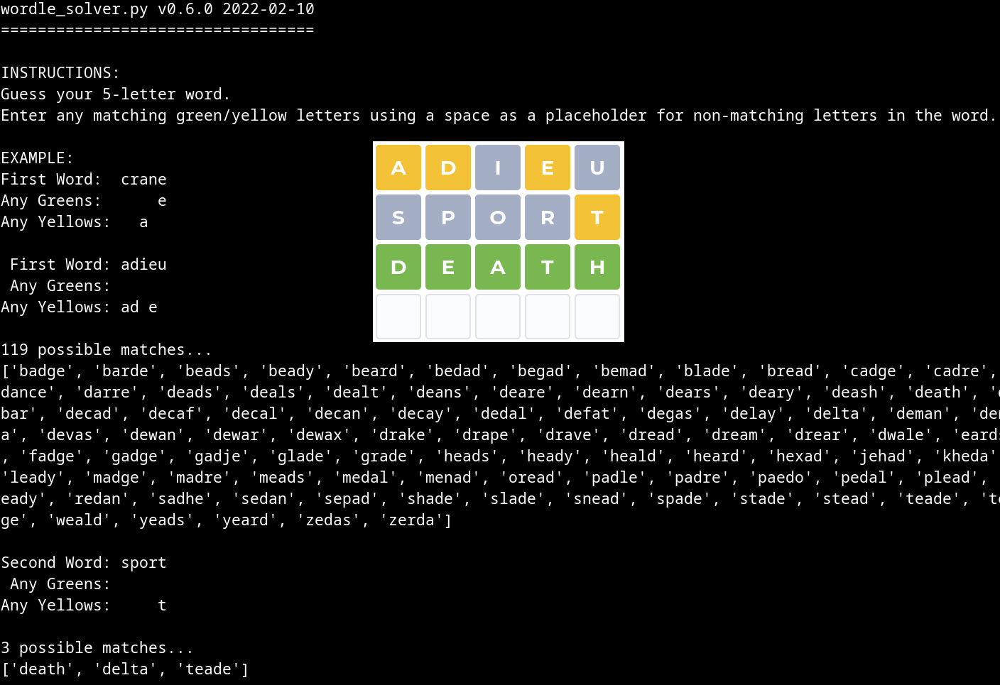

# Wordle Solver

A Python script that produces a list of possible words based on results from playing Wordle.

## About This Code
I wrote this script to gain some experience working with Pandas Data Frames.  And give me an extra edge competing with family/friends for the best Wordle score. :)

### Algorithm/How To Use
1. Provide the script with the word you entered and any matching yellow/green letters.
2. The script will reduce the list of possible words by:
	1. If a green letter is revealed, the script will remove all words that do not contain the green letter in the revealed position.
	2. If a yellow letter is revealed, the script will remove all words that contain the yellow letter in the revealed position (otherwise it would have been a green letter instead of a yellow).
	3. If a yellow letter is revealed, the script will remove all words that lack the yellow letter.
	4. Repeat for each word until only one match remains or all six words have been used.
3. Provide the user with a list of possible matches after each word.

### Hints
* After guessing your first word you don't have to guess a word using the list provided by the script.  (See usage below.)
* Guess using a word not on the list and not reusing any letters in the previous word can rule out additional letters, reveal more matching letters and greatly reduce the number of words left to choose from.

### Limitations
1. Functionality is limited to 5-character words only.

## Prerequisites
* Set environment variables (see config.py).

### Python Libraries
* See [pyproject.toml](pyproject.toml)
* Only pandas is required to run the script; All others are for testing code.

## Instructions For Use

* `python wordle_solver.py`

## Authors
* **Aaron Melton** - *Author* - Aaron Melton <aaron@aaronmelton.com>
